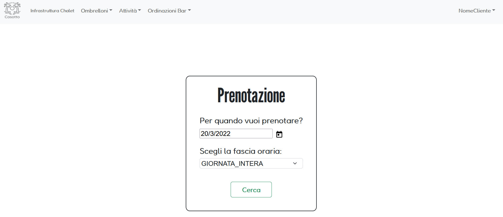

<div id="top"></div>
<!-- PROJECT LOGO -->
<br />
<div align="center">
  <a href="https://github.com/HTTPiego/ProjectSE-Unicam">
    
  </a>

<h3 align="center">Casotto</h3>

  <p align="center">
    Casotto è un progetto realizzato dal team 18Politico per gli esami di Ingegneria del Software e Progettazione di Applicazioni Web e Mobili dell'università di camerino. 
    <br />
    <a href="https://github.com/HTTPiego/ProjectSE-Unicam"><strong>Explore the docs »</strong></a>
    <br />
    <br />
    ·
    <a href="https://github.com/HTTPiego/ProjectSE-Unicam/issues">Report Bug</a>
    ·
    <a href="https://github.com/HTTPiego/ProjectSE-Unicam/issues">Request Feature</a>
  </p>
</div>


<!-- TABLE OF CONTENTS -->
<details>
  <summary>Tabella dei Contenuti</summary>
  <ol>
    <li>
      <a href="#riguardo-al-progetto">Riguardo al Progetto</a>
      <ul>
        <li><a href="#costruito-con">Costruito Con</a></li>
      </ul>
    </li>
    <li>
      <a href="#per-iniziare">Per Iniziare</a>
      <ul>
        <li><a href="#prerequisiti">Prerequisiti</a></li>
        <li><a href="#installazione">Installazione</a></li>
      </ul>
    </li>
    <li><a href="#roadmap">Roadmap</a></li>
    <li><a href="#contribuzione">Contribuzione</a></li>
    <li><a href="#licenza">Licenza</a></li>
    <li><a href="#contatti">Contatti</a></li>
  </ol>
</details>


<!-- ABOUT THE PROJECT -->
## Riguardo al Progetto

<br>

<div align="center" text-align: center;>
  prenotazione di un ombrellone:
    
 </div> 

<br>
Il progetto Casotto è una single page application scritta in Java che fa uso dei frameworks SpringBoot&SpringSecurity al backend e del framework Angular al frontend.

Il programma si inserisce nel contesto della realizzazione di uno Chalet smart. In particolare il sistema lato cliente, una volta essersi registrati e aver effettuato il login, permette di informarsi su come la struttura si compone, la prenotazione di diverse tipologie di ombrelloni per mezza o intera giornata, l'ordinazione di articoli bar dall'ombrellone e l'iscizione ad attività ludico/sportive proposte in giornata.
Invece lato gestionale è possibile, con diverse granularità di permessi definiti dall'autenticazione, amministrare il sistema, partendo dalla gestione delle ordinazioni bar direttamente notificate sui terminali degli adetti che possono poi prenderle in carico, saldo delle vendite in cassa, per arrivare infine all'intera gestione del personale/clienti, il delinemento delle informazioni circa lo chalet e dei cataloghi dei servizi proposti, prezzi annessi.
Tutti i dati vengono salvati e in un database per garantire la perdita dei dati stessi.

<p align="right">(<a href="#top">back to top</a>)</p>


### Costruito Con
* [Angular](https://angular.io/)
* [Bootstrap](https://getbootstrap.com)
* [Spring Boot](https://spring.io/projects/spring-boot)

<p align="right">(<a href="#top">back to top</a>)</p>


<!-- GETTING STARTED -->
## Per Iniziare

In seguito verrà illustrato come eseguire il progetto Casotto localmente. 

### Prerequisiti

* un server online/locale
* clonare la repository ```git clone https://github.com/HTTPiego/ProjectSE-Unicam.git ```
* [Maven](https://maven.apache.org/)
* [Node.js](https://nodejs.org)
* npm package manager (installato di default con Node.js)

### Installazione

1. Posizionarsi sul file  ```ProjectSE-Unicam/Casotto-Back-End/src/main/resources/application.properties``` ed impostare il proprio database (nelle prime cinque righe viene data una configurazione di default di un server mysql)
2. Posizionarsi sulla cartella ```ProjectSE-Unicam/Casotto-Back-End```
3. Eseguire il build con 
   ```sh
   mvn install
   ```
4. Eseguire il run con
   ```sh
   mvn spring-boot:run
   ```
5. Posizionarsi sulla cartella ```ProjectSE-Unicam/Casotto-Front-End```
6. Scaricare le dipendenze
   ```sh
   npm install 
   ```
7. Eseguire il build e servire l'applicazione
   ```sh
   ng serve 
   ```

<p align="right">(<a href="#top">back to top</a>)</p>


<!-- ROADMAP -->
## Roadmap

Back-End
- [x] Autenticazione (JWT) e Registrazione Utenti
- [x] Modifica credenziali utente
- [x] Prenotazione (Bar/Attività/Ombrelloni)
- [x] Cancellare Prenotazione (Bar/Attività/Ombrelloni)
- [x] Saldare Vendite
- [x] Catalogo Bar
- [x] Catalogo Attività
- [x] Catalogo Ombrelloni
- [x] Notifiche
- [x] Storico Prenotazioni (Bar/Attività/Ombrelloni) 
- [x] Csrf Token
- [ ] Caricamento immagine profilo utenti

Front-End
- [x] Home per tutti gli utenti
- [x] Home dedicata agli utenti loggati
- [x] Guardie
- [x] Salvare i token Crsf e JWT come cookie (JWT come cookie HttpOnly)
- [x] Mandare a ogni richiesta http i cookie necessari
- [ ] Qr Code per comprare gli articoli bar
- [ ] Profilo Utente

<p align="right">(<a href="#top">back to top</a>)</p>


<!-- CONTRIBUTING -->
## Contribuzione

I contributi sono ciò che rende la comunità open source un posto incredibile per imparare, ispirare e creare. Qualsiasi tuo contributo è **molto apprezzato**.
Se vuoi contribuire al progetto per renderlo migliore, perfavore esegui un fork di questo repository e crea una pull request,oppure, apri una issue con il tag "enhancement".
Non dimenticare di dare al progetto una stella! Grazie ancora!

1. Esegui un Fork del progetto
2. Crea un branch per il tuo miglioramento (`git checkout -b feature/AmazingFeature`)
3. Esegui un Commit dei tuoi miglioramenti (`git commit -m 'Add some AmazingFeature'`)
4. Esegui un Push sul branch (`git push origin feature/AmazingFeature`)
5. Apri una Pull Request

<p align="right">(<a href="#top">back to top</a>)</p>


<!-- LICENSE -->
## Licenza

Distribuito sotto la licenza MIT. Controlla `LICENSE.txt` per maggiori informazioni.

<p align="right">(<a href="#top">back to top</a>)</p>


<!-- CONTACT -->
## Contatti


Piermichele - piermichele.rosati@studenti.unicam.it
Diego - diegoan.belardinelli@studenti.unicam.it
Piero - piero.hierro1@gmail.com

<p align="right">(<a href="#top">back to top</a>)</p>


